# Laboratorio 1 DOSW
## Integrantes:
Maria Paula Rodriguez

Jacobo Diaz Alvarado

## Soluciones
### PARTE I
1. Crea un repositorio localmente.

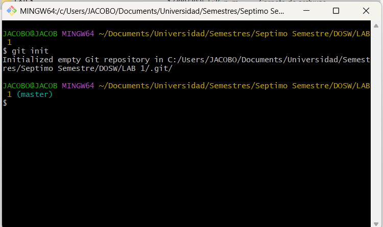

2. Agrega un archivo de ejemplo al repositorio, el README.md puede ser una gran opción.

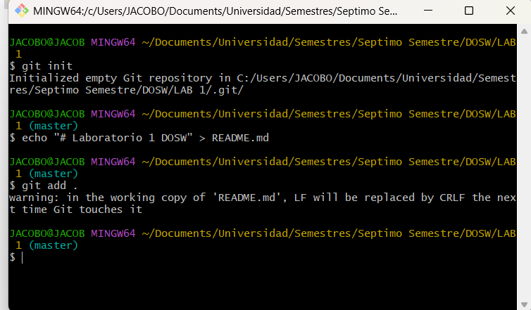

3. Averigua para qué sirve y como se usan estos comandos git add y git commit -m “mensaje”
   
   git add .: sirve para añadir nuevos archivos al repositorio
   
   git commit m- "Mensaje": sirve para anunciar el archivo que se añadió

4. Abre una cuenta de github, si ya la tienes, enlazala con el correo institucional.

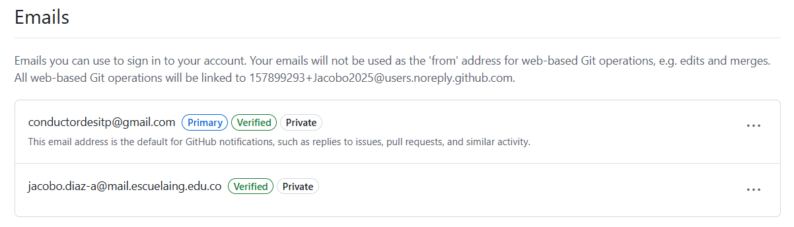

5. Crea un repositorio en blanco (vacío) e GitHub.

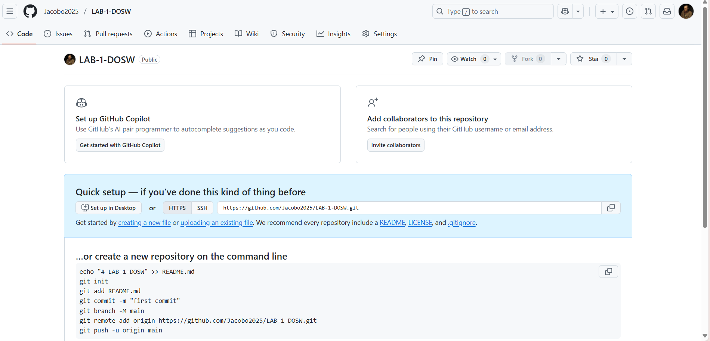

6.Configura el repositorio local con el repositorio remoto.

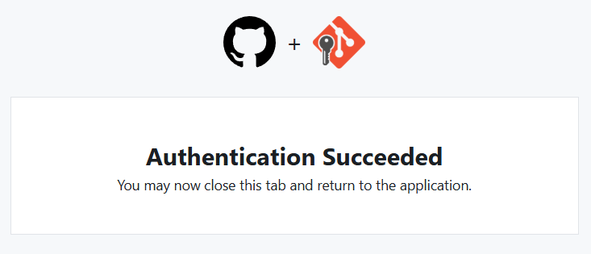

7. Sube los cambios, teniendo en cuenta lo que averiguaste en el punto 3 Utiliza los siguientes comando en el directorio donde tienes tu proyecto, en este orden:

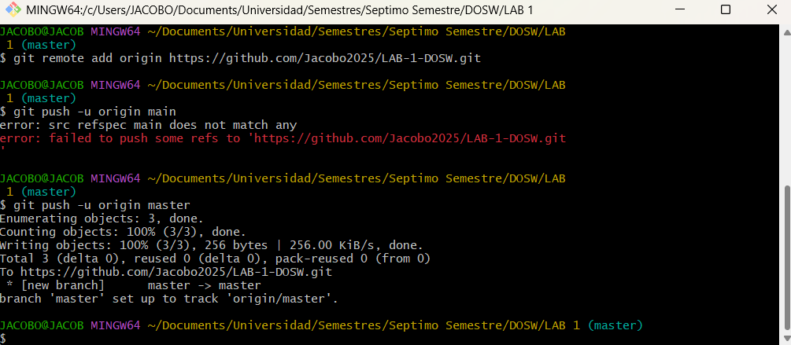

8. Configura el correo en git local de manera correcta Configurar correo electrónico en GitHub

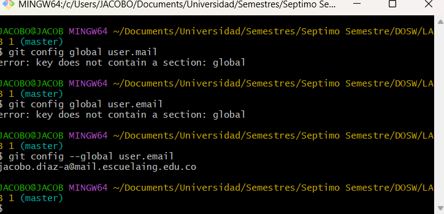

9. Vuelve a subir los cambios y observa que todo esté bien en el repositorio remoto (en GitHub).

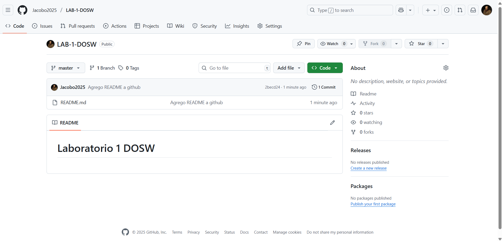

### PARTE II
1. Se escogen los roles para trabajar en equipo, una persona debe escoger ser "Owner" o Propietario del repositorio y la otra "Collaborator" o Colaborador en el repositorio.

Owner: María Paula Rodriguez

Collaborator: Jacobo Diaz

2. El owner agrega al colaborador con permisos de escritura en el repositorio que creó en la parte 1

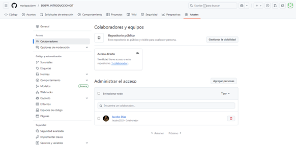

3. El owner le comparte la url via Teams al colaborador

4. El colaborador acepta la invitación al repositorio
   
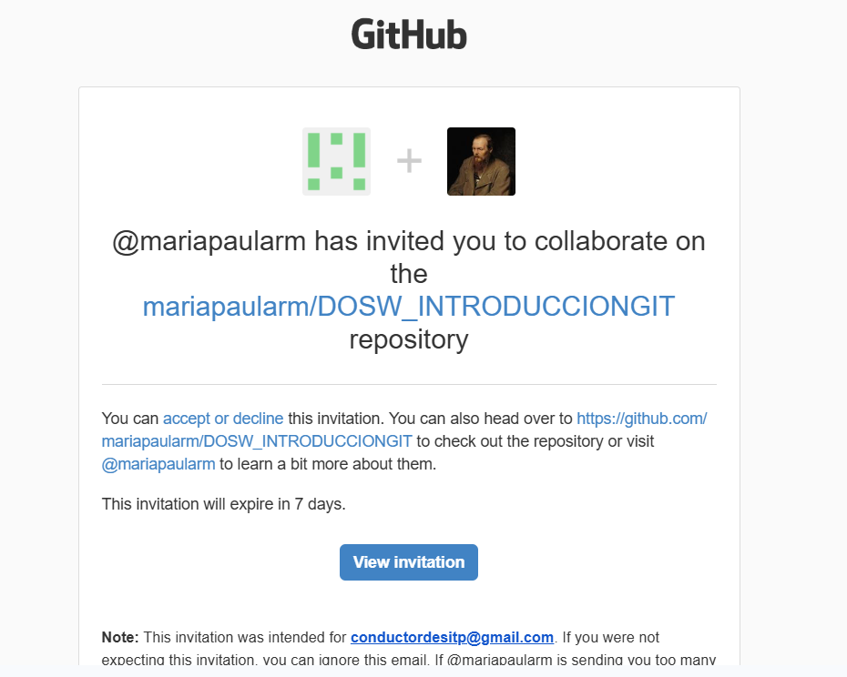

5. Owner y Colaborador editan el archivo README.md al mismo tiempo e intentan subir los cambios al mismo tiempo.

La edición del owner:

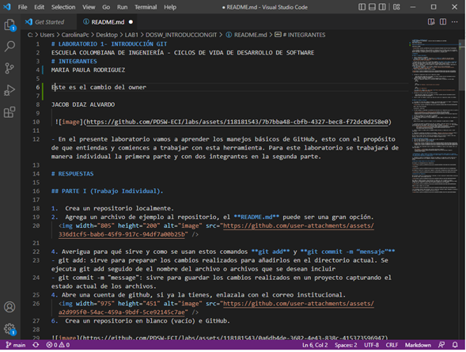

La edición del Colaborador

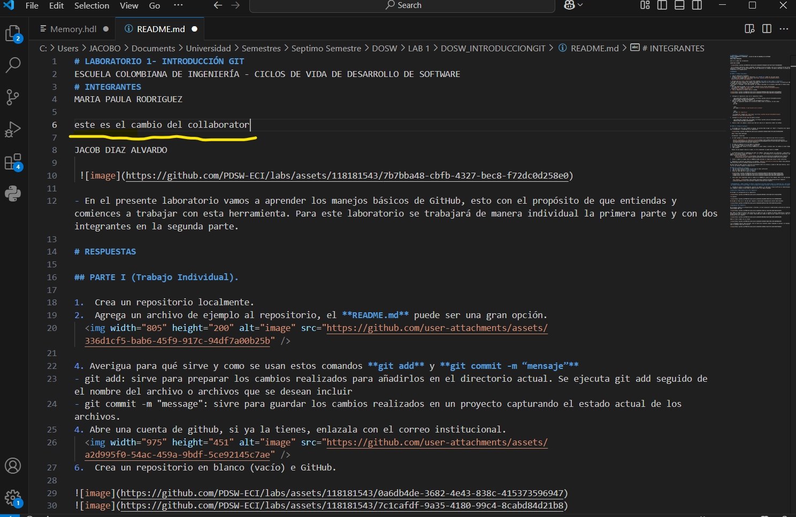

6. ¿Que sucedió?

Respuesta: Él que se demoró más no pudo hacer el commit y salió este error:

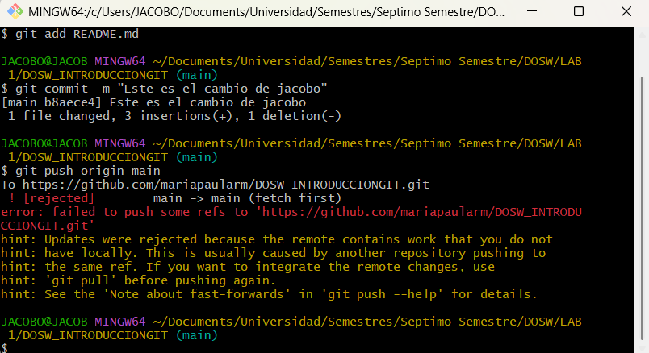

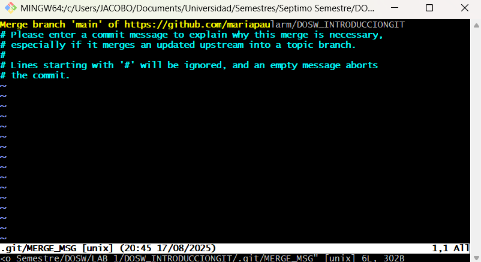

7. La persona que perdió la competencia de subir los cambios, tiene que resolver los conflictos, cúando haces pull de los cambios, los archivos tienen los símbolos <<< === y >>> (son normales en la resolución de conflictos), estos conflictos debes resolverlos manualmente. Como resolver Conflictos GitHub

Respuesta: en nuestro caso no salieron ninguno de esos simbolos.

8. Volver a repetir un cambio sobre el README.md ambas personas al tiempo para volver a tener conflictos.

Respuesta: esta vez decidimos editar la misma línea.

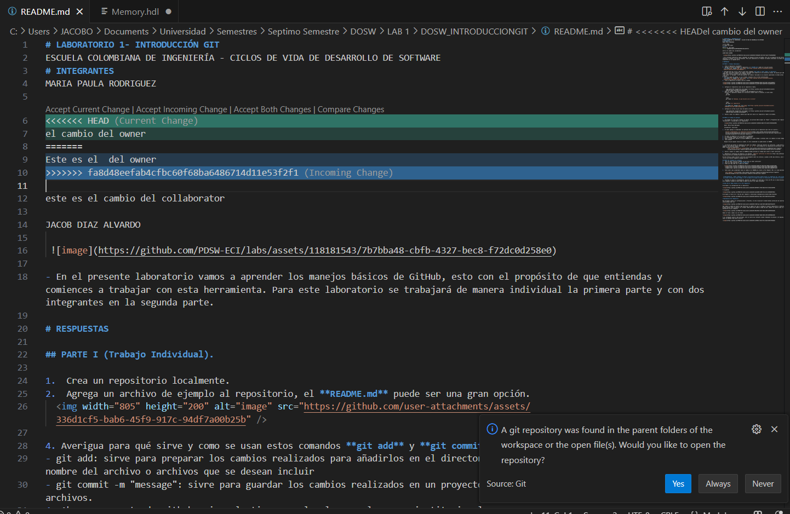

